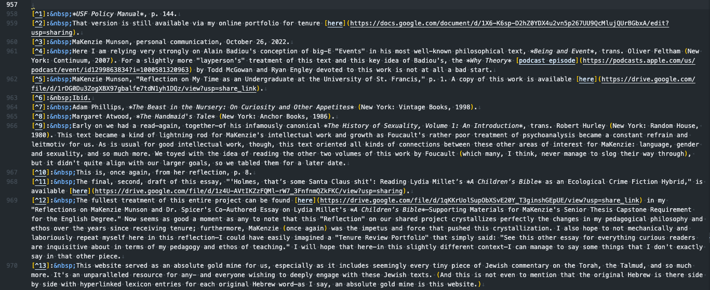
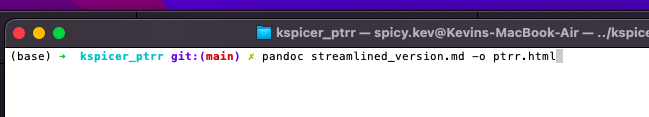
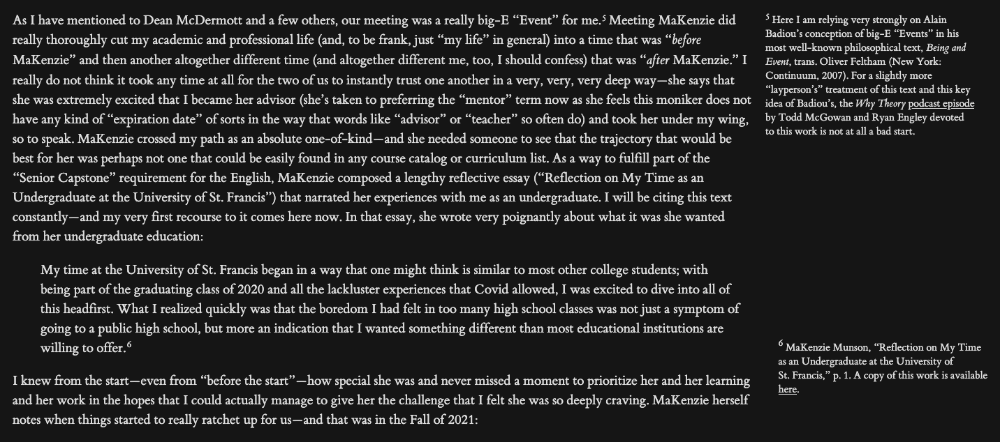

# Workflow for How I Made My Post-Tenure Review Reflection

## Step 0: Preliminary Thoughts

As I mention in [Section 2.2](ptrr.html#learning-to-code) of my Reflection, given that we academics are largely interested in the content of our work, of our thinking, any little bit of effort that helps us focus in on that is to be greatly prioritized. Why spend a great deal of time doing things that the computer/software can automate for us?  

## Step 1: Writing Everything in Markdown

There is something about writing in Markdown that is so simple and
effortless (no doubt that\'s by design). The goal of this format being that
it can be used, as the main [Markdown page](https://www.markdownguide.org/)
makes clear, "to format virtually any document," seems to be
tailor-made for academics, especially those of who don't often work
with images or figures or graphs or plots. The goal of our work is the
text, the text itself, not the flashy figures or supporting graphs, just
the text, so a format where one can focus as much as possible on the
actual content of the document seems to be an absolute necessity. Of
course, it's a wonderful benefit that something as simple as Markdown
can be easily converted ([pandoc](https://pandoc.org) is the conversion
tool of choice, of course) to pretty much any other format or file type
you want is an added benefit as well.

As some might know, it can be difficult to take things originally
written in Microsoft Word and other programs and easily get those texts
to live on the web---Markdown makes it a breeze. Wanting to hyperlink
something in a Word document can itself be time-consuming: selecting the
text where the hyperlink will appear, CTRL+K (or "Apple"+K for those on Macs),
pasting the link, etc. Markdown makes it so easy, just wrap the text in
\[\] and then follow it with a parenthesis that contains the actual
hyperlink: \[Here\'s a link\](link address goes here). Very simple. Of
course, for those academics that love the footnote, that\'s easy too:
just stick the footnote in brackets with a caret: \[\^1\] and then,
anywhere else in the same document, adding "\[\^1\]: Here's the text
of your footnote," will get exactly what one wants. Again, very
simple—and very easy once one gets the hang of it. So much else is easy to achieve: hyperlinks are, again, simply placed with square brackets with the URL in parenthesis right after it.  

## Step 2: Thinking about Styling the Document

Once one has all the content down and written, one can move on to thinking about what they would like the content to look like, ultimately (i.e. how does one want to "style" the content itself). I have for quite a while now—ever since starting down the "DH" path of my career—been quite taken with Edward Tufte's heavy use of "sidenotes" rather than "footnotes" or "endnotes."^[Here of course we mean his fantastic book, *The Visual Display of Quantitative Information*, 2nd Ed. (Cheshire, CT: Graphics Press, 2001).] I really quite like the [CSS](https://edwardtufte.github.io/tufte-css/) created by Dave Leipmann to reproduce (in .html) the kinds of layout and styling of Tufte's books.

Since the original Markdown file I created heavily utilized footnotes, one of the major things to do was going to be the conversion of those footnotes into a structure where those footnotes could become "sidenotes" and then get those properly styled by the CSS. The ["documentation"](https://edwardtufte.github.io/tufte-css/) for the Tufte CSS requires—in order to get the sidenotes working correctly—some HTML code that I would need to convert my footnotes into ... for each "sidenote" in the text, it would have to be wrapped in the following ```class```:

``` html
<label for="sn-demo"
       class="margin-toggle sidenote-number">
</label>
<input type="checkbox"
       id="sn-demo"
       class="margin-toggle"/>
```

where the ```label for=``` and ```input id=``` get changed to something descriptive for each sidenote. Thus, mine ended up looking like the following, for each sidenote (I should note that all of the above should be wrapped within a ```span``` class too so that the text going into the sidenote appears right after the creation of the note, like so):

``` html
<label for="sn-1" 
        class="margin-toggle sidenote-number">
</label>
<input type="checkbox" 
        id="sn-1" 
        class="margin-toggle"/>
        <span id="sn-1" class="sidenote">
            "Here is where we will put the text we want to go 
            into the sidenote itself."
        </span>
```

The CSS handles all the "footnote-like" numbering, so all that is required are unique descriptions in the aforementioned ```label for=``` and ```input id=``` spots. 

## Step 3: Converting Footnotes into Tufte "Sidenotes"

So now that we know what the CSS wants the data for each sidenote to look like, one can start getting their Markdown content with footnotes into the format that the CSS wants. The final Markdown version had footnotes following the Markdown syntax. They looked as follows:



Now, in creating the document originally, I hadn't yet decided on the Tufte CSS (which, in hindsight, might have been better if I had settled on it sooner and thus could have saved the task of converting the footnotes intto sidenotes)—, so one way to handle this would be to simply go and copy-paste all the text within each footnote into the sidenote format mentioned above. This is one way to do it, but it's far from efficient. I had over one-hundred footnotes and doing that manually would have been quite mad. Obviously, what would be nice is if we could write some code to search through the Markdown document, find all the footnotes (and footnote numbers) and replace them with html syntax needed for the CSS to work properly. Easy enough.

This is a pretty simple task for the machine, all that's needed is python's ```re``` [library](https://docs.python.org/3/library/re.html). We start with our usual procedures, importing our library and getting our file read in appropriately:

``` python
import re
markdown_file_path = '/path/to/our/markdown/file'

with open(markdown_file_path, 'r') as f:
    markdown_text = f.read()
```

Now, with that done, we can compile some [regular expressions](https://en.wikipedia.org/wiki/Regular_expression) (regex). We'll need to search for a couple of things, first, the footnote itself that occurs in the main body of the text, this, again, looks like: \[^1\]; second, we need to jump down and grab all of the text that, in the screenshot above, looks like \[^1\]:&nbsp; where the footnote text comes immediately after the non-breaking space character (\&nbsp;). So, we write some "regex" to find our footnote numbers and then our footnote text:

``` python
footnote_pattern = r"\[\^(\d+)\]"
footnote_matches = re.findall(footnote_pattern, markdown_text)
footnote_string = ", ".join(
                  ["[^" + match + "]" for match in footnote_matches])

footnote_text_pattern = r"\[\^(\d+)\]:\s*(.*?);[\n\s]*&nbsp;\s*(.*?)\n"
footnotes = re.findall(r'\[\^(\d+)\]:&nbsp;(.*?)(?=\n\[|$)', 
                        markdown_text, re.DOTALL)
```

Regex expressions so often look to us human readers as pure [gobbledy-gook](https://medium.com/factory-mind/regex-tutorial-a-simple-cheatsheet-by-examples-649dc1c3f285) (and, of course, there are tons of [packages](https://github.com/mikaelho/python-human-regex) designed to make these things more "readable" by us humans). What on earth is something like ```r"\[\^(\d+)\]"``` doing? I'll spare everyone the complications, but, most simply put, the regex above is going to search for anything that fits the pattern: \[^some number] and keep track of it; the second long regex (```r"\[\^(\d+)\]:\s*(.*?);[\n\s]*&nbsp;\s*(.*?)\n"```) is looking for anything of the form: \[^some number\]:\&nbsp;.

Once our scripts match all of these patterns, we want a nice way to store it so that we know what text goes with what footnote/number. A simple [Python dictionary](https://docs.python.org/3/tutorial/datastructures.html#dictionaries) is just what we need, where the keys will look something like this "\[^1\]" and the values will  be the actual text tied to that footnote. We create the "footnote dictionary" thusly:

``` python
fn_dictionary = {}
for footnote in footnotes:
    number = footnote[0]
    number_string = f'[^{number}]'
    text = footnote[1].strip()
    fn_dictionary[number_string] = text
```

This gives us exactly what we need. Now that we have this, we can create another variable that will store our html syntax (the code we'll want to ultimately replace with in our Markdown file):

``` python
html_template = '''<label for="sn-{num}" 
                    class="margin-toggle sidenote-number">
                </label>
                <input type="checkbox" 
                id="sn-{num}" 
                class="margin-toggle"/>
                <span class="sidenote" id="{num}">
                    {text}</span>'''
```

This should look familiar, as it's the same code that the CSS needs to properly style the sidenotes. We also have placeholders here ```{num}``` and ```{text}```, which is what will be replaced with the keys and values of our "footnote dictionary" respectively. 

Next we'll iterate over all the keys and values of our dictionary and use those to make the replacements within the original Markdown file (in earlier iterations of this the regex would throw errors if there were some characters in the pattern that we're properly "escaped," so the last two lines are meant to handle that and show us the spots where the error might have occurred):

``` python
for key, value in fn_dictionary.items():
    html = html_template.format(num=key[2:-1], text=value)
    try:
        markdown_text = re.sub(re.escape(key), html, markdown_text)
    except re.error as e:
        print(f"Error: {e}, Key: {key}, Value: {value}")
```

This code will move through the text of the Markdown file, find the patterns and replace (or substitute, in the ```re.sub()``` function call) those matched patterns with the ```html_template``` above (along with the text for each footnote), thus resulting in a nice replacement of the Markdown syntax for footnotes with the required html syntax needed to get those footnotes into the "sidenote" format. Then we can just output the new file with all the replacements like so:

``` python
with open('/Users/spicy.kev/Desktop/streamlined_version.md', 'w') as outfile:
    outfile.write(markdown_text)
    print("Successfully converted all your footnotes to sidenotes!")
```

With this out of the way, a simple trip to the command line so that we can have pandoc convert the .md to .html, all with the proper html syntax for the sidenotes:



After conversion, we get something that looks like this, where one can see the proper html code for the sidenotes:


## Step 4: CSS Styling Tweaks

Earlier above I made an off-handed remark about the possibility that knowing how one wants their Markdown ultimately to be "styled" could have saved a bit of work. I think there is much to say about this issue of what those in DH might call "proper text markup and encoding" (I have spoken quite a bit about this in some of my blog posts, [for example](https://kspicer80.github.io/posts/2022-04-20-tei-encoding-with-henry-james_11/)). It seems clear to me that if one doesn't quite know what they want to have the thing look like at the end of the day, we have this intuitive feeling that it would best in this case to be "flexible," in some sense—to create the content in a way that will make it easier for one to turn it into all kinds of different things later on down the workflow. Curiously (and, again, following our quite natural "intuition"), one might think that the desire to be "flexible" might mean to do as little as possible, to keep the data relatively unstructured so that it is "easier" (somehow) to give that unstructured data far more sophisticated structure later. This actually seems to the opposite of the best path to take; instead, what makes things flexible is creating the content in a way that is highly structured (highly "encoded") such that it's easier to find and transform what it is one wants, simply by the fact that if things are explicitly encoded, it's easier to find them and then transform them. Thus, there is an irony here: flexibility comes from *more* structure, *more* encoding, not less. What exactly do I mean? 

Let's see if I can make this clear using the html of the Markdown file we now have, along with the Tufte CSS to style it. We know that every sidenote lives within the "sidenote" class. One of the fantastic things about CSS is that it makes it incredibly easy to make one tiny little change in the ```.css``` file and have that tiny change "cascade" (thus the moniker of ["*cascading* style sheets"](https://en.wikipedia.org/wiki/CSS)) through all the instances of that ```sidenote class``` present within a file that is encoded using that class. Thus, just a few lines of code in the stylesheet can immediately alter a ton of other things within the document:

``` css
.sidenote,
.marginnote {
    float: right;
    clear: right;
    margin-right: -30%;
    width: 50%;
    margin-top: 0.3rem;
    margin-bottom: 0;
    font-size: 1.1rem;
    line-height: 1.3;
    vertical-align: baseline;
    position: relative;
    max-width: 300px;
    word-wrap: break-word;
}
```

Changes here will cascade through the document, making it far better than trying to handle this on a particular or case-by-case basis. As a concrete example, in my Post-Tenure Review Reflection document, I often had footnotes that were appearing at the end of some text within the ```<blockquote>``` tag. Since block quotes are indented from the left-hand margin, the sidenote would be slightly off on the right-side given how the CSS creates the "sidenote" container that lives along the right margin. One can make the ["CSS selectors"](https://www.w3schools.com/cssref/css_selectors.php) as precise as one might wish so as to select only very, very specific elements. Here below we're picking out only the data that lives within elements given in a ```blockquote``` living within a paragraph tag (```<p>```) while also possessing the ```.sidenote``` class:

``` css
blockquote p .sidenote,
blockquote p .marginnote {
    margin-right: -35.25%;
    text-align: left;
    max-width: 300px;
    width: 50%;
    position: relative;
    word-wrap: break-word;
}
```

Simple tweaks to the CSS selector in the ```.css``` file thus make it a breeze to transform things to get the notes attached to block quote elements to "line-up" better with the sidenotes that weren't appended to indented block quote paragraphs. One tiny change here and the effects are visible in all kinds of other places. Thus, getting the sidenotes appended to block quotes looks much better than they did originally without the slightly tweaked .css originally created by Liepmann:



Okay, but what's the lesson/takeaway here? Things are only "easy" here if one has tagged things properly ahead of time—thus, if the structure is there it's easy to find it and style it. If it's not, things already start to get onerous and time-consuming. The more specifically one structures the data, the easier things get (see [this blog post](https://kspicer80.github.io/posts/2023-01-13-canvas-live-api-work/) for more on this issue/concern of working with structured/unstructured data vis-à-vis the Instructure API for Canvas) to change because the structure needed to find and specify things is already working. This, I think, is one of the reasons why working with .pdfs should become less and less prevalent: it's hard to drill down and pinpoint specificities in within this document type.) Just imagine trying to finagle all the sidenotes that were attached to block quotes throughout a +60,000 word document. What a nightmare. 

## Step 5: Finalizing the Styling

Once everything is properly structured, tweaks to the styling make things so easy. Don't like the font size? Just change the CSS selector rules for all the text living within a ```<p>``` contained by the ```<body>``` element (or whatever). (Again, just imagine having to select all 60,000 words in Microsoft Word and then going up to the "Font" box, clicking through, selecting the right font and size—ugh!—here now just a couple of keystrokes get all the changes cascading across the document as a whole). Don't like where the Tufte CSS has the margin start along the left side? Again, a proper CSS selector to change the ```margin-left``` attribute of every ```<p>``` tag and away we go. Don't like the way the CSS handles figures? Once more, slight changes to the CSS selectors is in order:

``` css
figure {
    padding: 0;
    border: 0;
    font-size: 100%;
    font: inherit;
    vertical-align: baseline;
    max-width: 55%;
    -webkit-margin-start: 0;
    -webkit-margin-end: 0;
    margin: 0 0 3em 0;
}
```

Everything is easily controlled with all the data properly encoded, tagged, and structured. Font sizes, image sizes, everything is easy to change with only a couple keystrokes. (Imagine, one more time, having to individually select 20 images in Word and then dragging to resize each image—yeeesh, such a nightmare indeed. Every image should live within a `````` class, so just write the rule to select every time that class shows up ...) What about the way the captions on the images/figures are handled:

``` css
figcaption {
    margin-top: 0;
    margin-bottom: 0;
    font-size: 1.1rem;
    line-height: 1.6;
    vertical-align: baseline;
    position: relative;
    max-width: 40%;
    text-align: center;
    margin-left: auto;
    margin-right: auto;
}
```

and what if one wanted to not have to click through—manually—every figure caption? Slight tweaks again are called for here. So, long story short: time put in up front at the start to have the data tagged/encoded very specifically saves all kinds of work down the road. It becomes very clear to me how powerful (and no doubt significant) the [implementation of CSS](https://en.wikipedia.org/wiki/CSS#History) was when it occurred (still pretty early on in the WWW lifespan, I should say). It no doubt made so many things so much easier and so much more streamlined and far less time-consuming.  