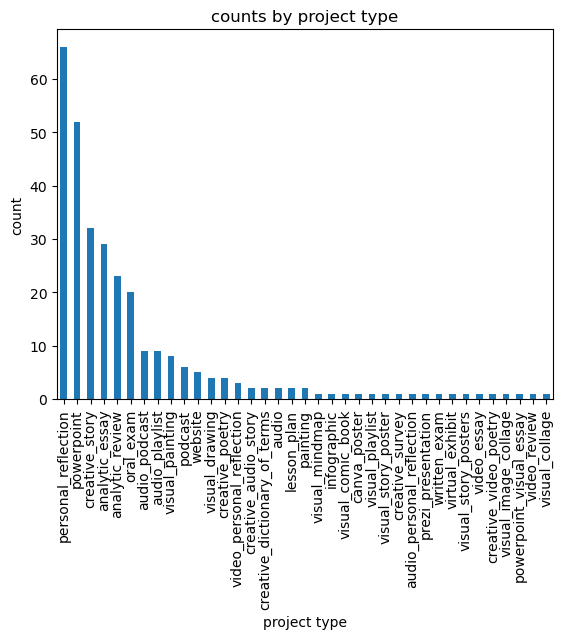
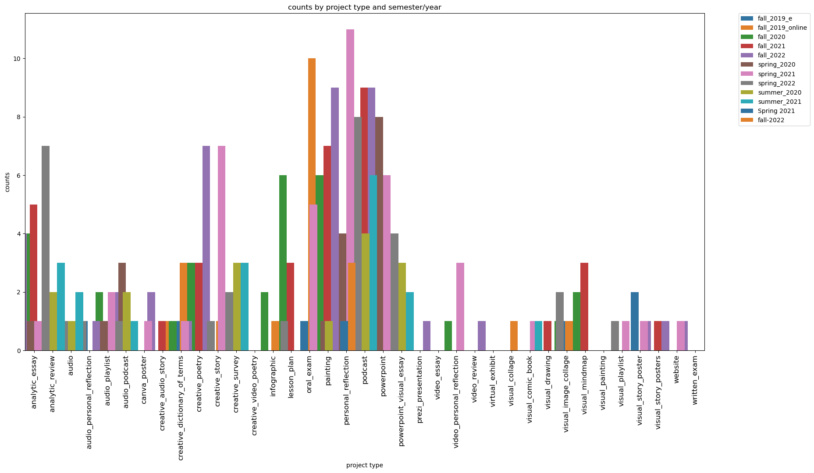
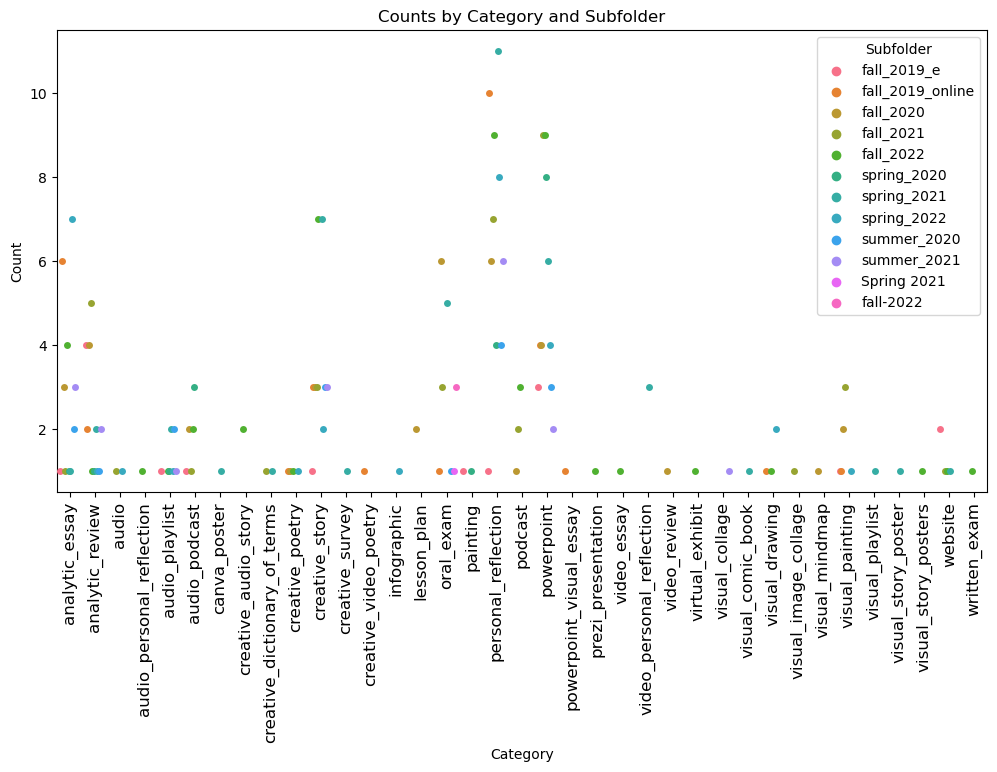
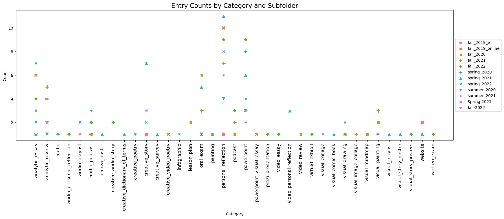

# Steps to Count the Different Kinds of Projects Students Have Submitted for ENGL200: Weird Fiction Students:

## Step 1: Gathering All the Files/Submissions into One Place:

For this project, I just went and did this the "old-fashioned" way. I went into each Canvas course shell and downloaded all of the submissions into their own separate folders named by semester/year:


## Step 2: Handling the .zip Files:

Since there is one file (one largish .zip) per folder containing all the submissions, we need to write a bit of code to extract them all. We could go and click each of these files individually and extract them, but there's no good reason to do that when we can automate and the computer can do it for us. We can use a nice standard python library [(```zipfile```)](https://docs.python.org/3/library/zipfile.html) to handle the file extraction:

``` python
import os
import zipfile

# loop through each file in the folder
for filename in os.listdir(zip_folder):

# only extract zip files
if filename.endswith('.zip'):
file_path = os.path.join(zip_folder, filename)

# extract the contents of the zip file to a folder named after the filename stem
with zipfile.ZipFile(file_path, 'r') as zip_ref:
	zip_ref.extractall(os.path.join(zip_folder, os.path.splitext(filename)[0]))
```

## Step 3: Counting File Extensions:

Now we have all the projects students submitted in one main folder. Next we can write some code to count the file extensions of all the files:

``` python
# These first two lines are absolutely standard in Python programming—here we load in the required libraries to do what we want to do ...
from pathlib import Path
import pandas as pd

# path to the folder containing all the submissions:
root_folder = Path("C:/Users/KSpicer/Desktop/final_projects")
file_types = defaultdict(int)
file_paths = {}

for file in root_folder.rglob('*'):
    if file.is_file():
        if file.parent == root_folder:  # Skip files in root folder
            continue
        file_extension = file.suffix
        file_types[file_extension] += 1
        folder_name = file.parent.name
        file_paths.setdefault(folder_name, []).append(file.name)

data = []
for folder_name, file_names in file_paths.items():
    for file_name in file_names:
        data.append((folder_name, file_name, Path(file_name).suffix))

df = pd.DataFrame(data, columns=['Subfolder', 'Filename', 'Extension'])
df['category'] = ""
df.to_json('list_of_files.json', orient='records')
```

This results in a nice [pandas dataframe](https://pandas.pydata.org/) that gives us three columns that are keeping track of the folder (that tells us the semester/year for each submission), the filename (just in case we might want that information), and, lastly, the file extension. We've also added a fourth column, "category," which is where we'll keep track of the kind of project the submission fits under—the first 25 rows of the dataframe look like this:


Now we could just plot all of the different file extensions and then deduce from them the kinds of projects they might be. If they're image formats (.jpg, .png, etc.), then they were probably something visual. If they're in audio formats (.mp3, mp4, etc.), then they're no doubt audio projects of some kind. If they come with .pptx, then "Powerpoint" is the proper conclusion, obviously. When we get to file formats of a textual nature (.pdf, .txt, .docx) things are a little tricker. Are they personal reflections? Are they analytical essays? Are they creative stories, poems, dramas, etc.? Well, again, let's write some code to make this a little easier.

## Step 4: A Faster Way to Do Initial Inspections (and Labeling) of Files:

What we want to do is create some code that would give us an easy way to look at the first thousand or so characters in each file—usually it's clear right at the start if the file is a creative story, analytical essay, personal reflection, etc. So, again, to the code we go! What we'll do here is read in each file, have it print out the first 1000 characters, and then dump all of that to another text file that we can look at at our leisure and then code each file accordingly.

``` python
# As per usual, import the necessary python libraries
import os
import PyPDF2
import docx

input_dir = r"C:/Users/KSpicer/Desktop/final_projects"
output_file = r"C:/Users/KSpicer/Desktop/final_projects/txt_files.txt"

with open(output_file, 'w') as out_file:
    for dirpath, dirnames, filenames in os.walk(input_dir):
        for filename in filenames:
            if filename.endswith('.txt'):
                file_path = os.path.join(dirpath, filename)
                try:
                    with open(file_path, 'r', encoding='utf-8') as in_file:
                        file_content = in_file.read()
                        if len(file_content) == 0:
                            continue
                        first_1000_chars = file_content[:1000]
                        out_file.write(f'--- {os.path.relpath(file_path, input_dir)} ---\n')
                        out_file.write(first_1000_chars)
                        out_file.write('\n\n')
                except UnicodeDecodeError:
                    print(f'Skipping file {file_path} due to UnicodeDecodeError')
            elif filename.endswith('.pdf'):
                file_path = os.path.join(dirpath, filename)
                # Handle PDF files as before...
            elif filename.endswith('.docx'):
                file_path = os.path.join(dirpath, filename)
                try:
                    doc = docx.Document(file_path)
                    file_content = '\n'.join([paragraph.text for paragraph in doc.paragraphs])
                    if len(file_content) == 0:
                        continue
                    first_1000_chars = file_content[:1000]
                    out_file.write(f'--- {os.path.relpath(file_path, input_dir)} ---\n')
                    out_file.write(first_1000_chars)
                    out_file.write('\n\n')
                except Exception as e:
                    print(f'Skipping file {file_path} due to error: {e}')
```

This code gives us something that looks like the following:


As one can see, we have the full path to each file in between three hyphens, "---", and then we have the first 1000 characters in that file. If we go back up to the first code snippet, we had a dataframe with information in four columns. Up there we dumped that into a .json file that looks like this:


The reader will notice the [```.json``` file](https://www.w3schools.com/whatis/whatis_json.asp) above had entries with the "category" filled in, but at this point that field should be blank. Now, what one can do is move through all the text files, have a look at the first 1000 characters, and then code it appropriately. In this case, the first file got a "personal_reflection" label, and so on. (Actually, the sample image shows a repeated entry for this student, who uploaded both a .txt and .docx version to the Canvas shell).

This will allow us to tag all of the projects that had a textual file format as something more specific: "personal_reflection," "analytic_essay," "creative_story," "creative_poem," and so forth. The only ones that need a closer look are all the files that are in .pdf. I often have students that upload presentations that are multimodal (and "Powerpoint-esque") in some way, so those are ones that need a little more inspection. Additionally, students that do paintings of the stories (or "movie posters" for the stories they loved) will often take photographs and then put them in .pdf files—so those also need a little more TLC. But, as I say, this is to be much preferred over opening up every single folder and looking at the contents. This is so much faster and one can plough through ten semesters' worth of student submissions in minutes.

## Step 5: Let's Plot Some of This Data:

Once we have our ```.json``` file with all the projects properly tagged with the appropriate category, we can write some more code to produce some nice plots of all this information. So, once again, off to the code we go again!

```python
import matplotlib.pyplot as plt
import pandas as pd
import seaborn as sns

df = pd.read_json("student_project_types.json")
counts = df['category'].value_counts()
```

```python
counts.plot(kind='bar')
plt.xlabel('project type')
plt.ylabel('count')
plt.title("counts by project type")
plt.show()
```


```python
sns.barplot(x=counts.index, y=counts.values)
plt.xlabel('project type')
plt.ylabel('count')
plt.title("counts by project type")
plt.xticks(rotation=90)
plt.show()
```


```python
df.head()
```
<div>
<style scoped>
    .dataframe tbody tr th:only-of-type {
        vertical-align: middle;
    }

    .dataframe tbody tr th {
        vertical-align: top;
    }

    .dataframe thead th {
        text-align: right;
    }
</style>
<table border="1" class="dataframe">
  <thead>
    <tr style="text-align: right;">
      <th></th>
      <th>Subfolder</th>
      <th>Filename</th>
      <th>Extension</th>
      <th>category</th>
    </tr>
  </thead>
  <tbody>
    <tr>
      <th>0</th>
      <td>fall_2019_e</td>
      <td>andrademichelle_3883572_59268715_final project...</td>
      <td>.docx</td>
      <td>analytic_review</td>
    </tr>
    <tr>
      <th>1</th>
      <td>fall_2019_e</td>
      <td>bushnojordan_3815623_59274415_Jordan Bushno.docx</td>
      <td>.docx</td>
      <td>analytic_review</td>
    </tr>
    <tr>
      <th>2</th>
      <td>fall_2019_e</td>
      <td>delrioclarissa_3878126_59274267_Delrio.c_WEIRD...</td>
      <td>.docx</td>
      <td>analytic_review</td>
    </tr>
    <tr>
      <th>3</th>
      <td>fall_2019_e</td>
      <td>donahuebrett_3889252_59267011_Weird Lit Final ...</td>
      <td>.zip</td>
      <td>website</td>
    </tr>
    <tr>
      <th>4</th>
      <td>fall_2019_e</td>
      <td>harperriley_3886388_59252941_FinalExam.docx</td>
      <td>.docx</td>
      <td>painting</td>
    </tr>
  </tbody>
</table>
</div>

```python
counts = df.groupby(['category', 'Subfolder']).size().reset_index(name='count')

# Plot the counts as a bar chart using seaborn—it's a little jumbled, so we'll probably think about some other visualization types that might work better ...
plt.figure(figsize=(20, 10))
#sns.color_palette('plasma', as_cmap=True)
sns.color_palette('tab10')
sns.barplot(x='category', y='count', hue='Subfolder', data=counts, palette='tab10', width=5, dodge=50)
plt.xlabel('project type')
plt.ylabel('counts')
plt.title('counts by project type and semester/year')

# Adjust the legend position
plt.legend(bbox_to_anchor=(1.05, 1), loc=2, borderaxespad=0.)
plt.xticks(rotation=90)
plt.xticks(fontsize=12)
plt.show()
```

```python
import seaborn as sns
import matplotlib.pyplot as plt

g = sns.stripplot(x='category', y='count', hue='Subfolder', data=counts, jitter=100, dodge=True)

# Customize the plot
g.figure.set_size_inches(12, 6)
plt.xlabel('Category')
plt.ylabel('Count')
plt.xticks(rotation=90)
plt.xticks(fontsize=12)
plt.title('Counts by Category and Subfolder')
plt.show()
```

```python
# Count the number of entries for each category and subfolder
counts = df.groupby(['category', 'Subfolder']).size().reset_index(name='count')

# Set the color palette
sns.set_palette('Set2', 9)
plt.figure(figsize=(20, 6))
# Create a scatterplot with different markers for each subfolder
g = sns.scatterplot(x='category', y='count', hue='Subfolder', style='Subfolder', data=counts, s=100)

# Set the axis labels and title
g.set(xlabel='Category', ylabel='Count')
g.set_title('Entry Counts by Category and Subfolder', fontsize=16)

# Adjust the legend position
g.legend(loc='center left', bbox_to_anchor=(1, 0.5))

# Adjust the figure size and spacing
plt.xticks(rotation=90)
plt.xticks(fontsize=12)
plt.show()
```


Thus we have all the plots we need.